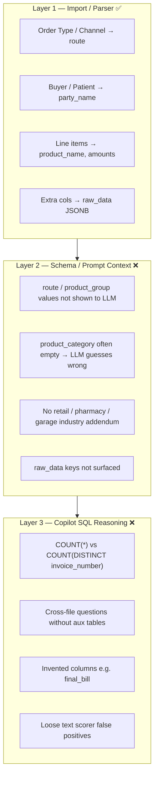

# Copilot Answer Hardening

> **Context:** Universal SMB benchmark run on **production Supabase** (2026-07-25). Three synthetic datasets (café, pharmacy, garage) imported to three Business-plan tenants. **30 copilot questions** asked via in-process agent (OpenRouter + production DB). **Parser/import passed** on all primary files. Baseline copilot score **5/30 (16.7%)**; post-hardening re-run also **5/30** with improved SQL quality and companion data loaded.

This document catalogs observed failures, root causes, full question-by-question results, and concrete approaches to harden copilot answers.

---

## Post-hardening re-run (2026-07-25, second pass)

**Harness:** `run_production_benchmark.py --xlsx-only` (café skips duplicate online_orders CSV)  
**Results:** `benchmark/universal-smb/results/production_benchmark_20260725_084906.json`  
**Log:** `benchmark/universal-smb/results/benchmark_run_hardened.log`

| Metric | Baseline | Post-hardening |
|--------|----------|----------------|
| Overall | 5/30 (16.7%) | **5/30 (16.7%)** |
| Single-table Q1–Q6 | ~4/18 | **3/18** |
| Cross-file Q7–Q10 | ~1/12 | **2/12** |
| Companion CSVs imported | No | **Yes (12 files)** |
| Adjusted (strict text) | ~3/30 | **5/30** (false positives removed) |

**Passed:** cafe_q03, cafe_q07, pharmacy_q01, pharmacy_q03, garage_q08

**Gained vs baseline:** pharmacy_q01, cafe_q07, garage_q08  
**Lost vs baseline:** pharmacy_q06, garage_q06, garage_q10 (last two were false-positive passes before)

**Notable improvements (non-pass):** cafe_q01 now filters `route ILIKE 'dine-in'` → ₹531K vs expected ₹545K (was ₹2.1M with no filter). Guardrails no longer flag channel terms like Swiggy when in tenant vocabulary.

**Still blocking ≥22/30 target:** garage single-table 0/6; cross-file JOIN SQL errors (nested aggregates, bad GROUP BY); LLM ignoring companion-table patterns on several Q8–Q10 questions.

---

## Benchmark run summary

**Run date:** 2026-07-25  
**Harness:** `benchmark/universal-smb/scripts/run_production_benchmark.py`  
**Raw results:** `benchmark/universal-smb/results/production_benchmark_latest.json`  
**Run log:** `benchmark/universal-smb/results/benchmark_run.log`

### Tenant ↔ dataset mapping

| User | Tenant | Business | Primary import(s) | Rows inserted |
|------|--------|----------|---------------------|---------------|
| `fadenthreads@gmail.com` | Bandi traders (`20680f1e-…`) | **Café** BrewLab | `BrewLab_Sales_Report_Jan-Jun2026.xlsx` + `online_orders_jan_jun.csv` | 37,380 + 14,570 |
| `meghanajhadi28@gmail.com` | Faden (`1287ace7-…`) | **Pharmacy** MedPlus | `retail_sales_register.csv` | 26,079 |
| `nandarishik.bandi13@gmail.com` | AKARA Demo (`8a6141c2-…`) | **Garage** AutoCare | `service_invoices.xlsx` | 6,121 |

Each tenant's `sales_data` was cleared before import. Only manifest `import: true` files were loaded (companion CSVs for cross-file questions were **not** imported).

### Overall scores

| Vertical | Passed | Total | Pass rate |
|----------|--------|-------|-----------|
| Café | 1 | 10 | 10% |
| Pharmacy | 2 | 10 | 20% |
| Garage | 2 | 10 | 20% |
| **Overall** | **5** | **30** | **16.7%** |

**Adjusted score (excluding false-positive text passes):** **3/30 (10%)**

| ID | Scored | Actually correct? |
|----|--------|-------------------|
| cafe_q03 | PASS | Yes |
| pharmacy_q03 | PASS | Yes (4/5 product names) |
| pharmacy_q06 | PASS | Yes (4.00% vs expected 4%) |
| garage_q06 | PASS | **No** — answered 0%/0%; scorer matched keywords "labour"/"parts" |
| garage_q10 | PASS | **No** — answered ₹0/₹0; scorer matched keywords "approved"/"billed" |

**Key insight:** Import and parser work. Failures are overwhelmingly **schema context + SQL generation + missing cross-file data**, not ingestion.

---

## Café results — fadenthreads (1/10)

| ID | Question | Expected | Copilot answer | Result | Root cause |
|----|----------|----------|----------------|--------|------------|
| cafe_q01 | Dine-in revenue March 2026 | ₹544,633 | **₹2,141,510** | FAIL | No `route = 'dine-in'` filter; summed all March `net_amount` |
| cafe_q02 | Swiggy orders Feb 2026 | 629 | **2,403** | FAIL | `COUNT(*)` + `party_name = 'Swiggy'` instead of `COUNT(DISTINCT invoice_number)` + `route` |
| cafe_q03 | Top 5 menu items by qty | Veg Wrap, Croissant, … | Correct top 5 | **PASS** | `GROUP BY product_name` works |
| cafe_q04 | MoM revenue change Mar→Apr | -14.39% | **-15.05%** | FAIL | Close but outside tolerance; all-channel totals |
| cafe_q05 | Customers with >3 visits | 200 | **122** | FAIL | `COUNT(*)` line items per `party_name`, not distinct invoices |
| cafe_q06 | Avg dine-in discount % | 6% | "insufficient data" | FAIL | `product_category = 'Dine-in'` — channel is in **`route`** |
| cafe_q07 | Gross profit proxy March | ₹783,368 | "missing wastage" | FAIL | Wastage CSV not imported; wrong channel column |
| cafe_q08 | Dine-in revenue per shift hour | ₹1,927 | "no data" | FAIL | Shift roster not imported; `product_category` filter |
| cafe_q09 | Settlement variance June | ₹166 | **-₹652,650** | FAIL | Settlement CSV not imported; invented formula from sales cols |
| cafe_q10 | Invoice line vs header mismatches | 0 | **20,099** | FAIL | Compared line `total_amount` vs sum of `net_amount` per invoice |

### Representative SQL (failures)

**cafe_q01** — missing channel filter:
```sql
SELECT SUM(net_amount) FROM sales_data
WHERE invoice_date BETWEEN '2026-03-01' AND '2026-03-31'
-- should add: AND route ILIKE 'dine-in'
```

**cafe_q02** — line count + wrong entity:
```sql
SELECT COUNT(*) FROM sales_data
WHERE party_name = 'Swiggy' AND invoice_date BETWEEN ...
-- should be: COUNT(DISTINCT invoice_number) AND route ILIKE 'swiggy'
```

---

## Pharmacy results — meghana (2/10)

| ID | Question | Expected | Copilot answer | Result | Root cause |
|----|----------|----------|----------------|--------|------------|
| pharmacy_q01 | March retail revenue | ₹1,287,149 | **₹1,290,599** | FAIL | ~0.3% off — `net_amount` vs ground-truth basis |
| pharmacy_q02 | OTC bills Feb 2026 | 1,201 | **4,008** | FAIL | `COUNT(*)` all Feb rows — no OTC channel filter on `route` |
| pharmacy_q03 | Top 5 medicines by qty | ORS Sachet, Cetirizine, … | 4/5 correct | **PASS** | Ranking works; Atorvastatin swapped for Azithromycin |
| pharmacy_q04 | MoM revenue change Mar→Apr | -0.54% | **-0.69%** | FAIL | Close but outside 2% tolerance |
| pharmacy_q05 | Patients >3 purchases | 500 | **100** | FAIL | `COUNT(*)` line items, not distinct invoices |
| pharmacy_q06 | Avg discount across bills | 4% | **4.00%** | **PASS** | `SUM(discount)/SUM(gross)` formula correct |
| pharmacy_q07 | Net revenue after write-offs June | ₹1,282,579 | ₹1,288,733 | FAIL | Guessed `product_name LIKE '%expired%'`; write-offs CSV not imported |
| pharmacy_q08 | Top pharmacist revenue/bill April | Meera K | **Patient 148** | FAIL | Used `party_name` (patients); pharmacist in shift CSV / `raw_data` |
| pharmacy_q09 | Doctor referral revenue Q1 | ₹792,954 | "unavailable" | FAIL | `party_name LIKE '%Doctor%'` — referrals CSV not imported |
| pharmacy_q10 | Return rate by refund June | 0.34% | **95.91%** | FAIL | Used `discount_amount > 0` as refund proxy — wrong |

---

## Garage results — nanda (2/10, mostly false passes)

| ID | Question | Expected | Copilot answer | Result | Root cause |
|----|----------|----------|----------------|--------|------------|
| garage_q01 | March service revenue | ₹1,305,673 | **₹0** | FAIL | Query returned zero — investigate date parsing / amount columns on garage import |
| garage_q02 | Insurance jobs Feb 2026 | 15 | **0** | FAIL | `product_category = 'Insurance Channel'` — garage uses **`route`** / **`product_group`** |
| garage_q03 | Top 5 spare parts by revenue | Battery 45Ah, … | "no spare parts" | FAIL | `product_category = 'Spare Parts'` — wrong column |
| garage_q04 | MoM revenue change Mar→Apr | +3.92% | **-5.90%** | FAIL | Wrong sign and magnitude |
| garage_q05 | Customers >2 service visits | 120 | **83** | FAIL | `COUNT(invoice_number)` not `COUNT(DISTINCT invoice_number)` |
| garage_q06 | Labour vs parts line % | 71.4% / 28.6% | **0% / 0%** | PASS* | **False pass** — keyword scorer only; `product_category` empty |
| garage_q07 | Parts gross margin March | ₹927,810 | -₹555,450 | FAIL | Cross-file (vendor purchases); guessed from same `sales_data` table |
| garage_q08 | Mechanic revenue per labour hour Q2 | Suresh P | "no data" | FAIL | Timesheet CSV not imported; grouped by `product_name` |
| garage_q09 | Estimate-to-final variance % | 60.34% | "insufficient data" | FAIL | SQL referenced **`final_bill` column — does not exist** (query error) |
| garage_q10 | Insurance billed vs approved | billed ₹425k, approved ₹361k | **₹0 / ₹0** | PASS* | **False pass** — keywords "approved"/"billed" matched; values wrong |

### Garage-specific concern

Garage Q01–Q03 returned **₹0 or empty** despite 6,121 rows imported. Likely causes to investigate:

- `invoice_date` parsing on `service_invoices.xlsx` (dates not landing in Mar 2026 range)
- Line type stored in `product_group` (Parts/Labour) not `product_category`
- Channel (insurance/cash) in `route`, not `product_category`

---

## Cross-cutting failure patterns


| Pattern | Affected questions | Fix tier |
|---------|-------------------|----------|
| Channel in **`route`**, copilot uses **`product_category`** | cafe Q01,Q06; pharmacy Q02; garage Q02,Q03,Q06 | Tier 1 |
| **`COUNT(*)`** instead of **`COUNT(DISTINCT invoice_number)`** | cafe Q02,Q05; pharmacy Q02,Q05; garage Q05 | Tier 1 |
| **`product_group`** for line type (parts/labour), not category | garage Q03,Q06 | Tier 1 |
| Cross-file questions without aux CSV/tables | Q07–Q10 all verticals (difficulty ≥7) | Tier 3 |
| **`raw_data`** not in schema context (cashier, pharmacist, mechanic) | cafe Q08; pharmacy Q08; garage Q08 | Tier 2 |
| Guardrail **`premise_check`** false alarms | ~25/30 questions ("swiggy", "february", "what") | Tier 1 |
| **Scorer false positives** on text/rubric questions | garage Q06, Q10 | Tier 2 |
| Garage **₹0 revenue** despite rows present | garage Q01–Q03 | Investigate import |

### By difficulty tier

| Tier | Scope | Café | Pharmacy | Garage | Notes |
|------|-------|------|----------|--------|-------|
| Q1–Q3 (easy) | Single-table filter/aggregate/rank | 1/3 | 1/3 | 0/3 | Ranking works; filters fail |
| Q4–Q6 (medium) | MoM, customer counts, discount % | 0/3 | 1/3 | 1/3* | *garage Q06 false pass |
| Q7–Q10 (hard) | Cross-file / anomaly | 0/4 | 0/4 | 1/4* | *garage Q10 false pass |

---

## Three failure layers



---

## Layer 1 — Schema & prompt fixes (highest ROI)

### 1A. Enrich schema context with sample distinct values

**Problem:** `SchemaDiscovery.get_schema_context()` samples products, parties, zones, categories — but **not `route` or `product_group`**, even though channels and line types land there after import.

**File:** `backend/app/services/schema/discovery.py`

**Approach:**

- Add `route` and `product_group` to distinct-value sampling.
- When `product_category` is empty but `route` has values, inject:

  ```
  Known sales channels (route column): dine-in, swiggy, otc, insurance, …
  Known line types (product_group column): Parts, Labour, Rx, OTC, …
  ```

**Fixes:** café Q01,Q02,Q06; pharmacy Q02; garage Q02,Q03,Q06.

---

### 1B. Industry addendums (retail, pharmacy, garage)

**Problem:** Only `fmcg_distribution` has planner rules in `_INDUSTRY_ADDENDUMS`. Test tenants use `fmcg_distribution`, `retail_chain`, etc. — none get POS/vertical guidance.

**File:** `backend/app/services/prompts/generator.py`

| Industry key | Key rules |
|--------------|-----------|
| `retail_chain`, `cafe`, `restaurant` | Channel → **`route`**; orders → **`COUNT(DISTINCT invoice_number)`** |
| `pharmacy`, `pharma_retail` | OTC/Rx channel → **`route`**; bills → distinct invoices |
| `auto_service`, `garage` | Insurance/cash → **`route`**; parts/labour → **`product_group`** |

**Fixes:** systematic column guidance across all verticals.

---

### 1C. Column semantic aliases in schema context

Document in every tenant's schema context:

```
User terms → columns:
  dine-in / swiggy / zomato / OTC / insurance → route
  parts / labour / spare → product_group
  menu item / medicine / part name → product_name
  bill / order / job → invoice_number
  customer / patient → party_name
  cashier / pharmacist / mechanic → raw_data (if not in schema columns)
```

---

## Layer 2 — Guardrails & scoring

### 2A. Fix `premise_check`

**Problem:** Flags legitimate terms (`swiggy`, `february`, `what`, `many`) because they are not column names.

**Recommendation:** Pass distinct values from `route`, `product_name`, `product_group` as allowed vocabulary. Expand stopword list for months and question words.

**File:** `backend/app/services/copilot/guardrails/checks.py`

---

### 2B. Tighten text / rubric scorer

**Problem:** `garage_q06` and `garage_q10` passed because response contained keywords (`labour`, `parts`, `approved`, `billed`) while numeric answers were wrong.

**File:** `benchmark/universal-smb/harness/scorer.py`

**Approach:** For `answer_type: text` with expected numeric sub-values, require parsed numbers within tolerance — not keywords alone.

---

## Layer 3 — SQL generation & query patterns

### 3A. Global planner rules (all industries)

**File:** `backend/app/services/copilot/planner.py`

- Orders / bills / visits / jobs → **`COUNT(DISTINCT invoice_number)`**
- Customer repeat metrics → **`GROUP BY party_name HAVING COUNT(DISTINCT invoice_number) > N`**
- Channel filters → **`route`**, not `product_category`
- Line type (parts/labour) → **`product_group`**
- Discount % → `SUM(discount_amount) / NULLIF(SUM(gross_amount), 0) * 100`
- Never reference columns not in schema (`final_bill`, etc.) — use `raw_data->>'key'` if needed

---

### 3B. Query templates for channel + count questions

```sql
-- Channel order count
SELECT COUNT(DISTINCT invoice_number)
FROM public.sales_data
WHERE tenant_id = :tenant_id
  AND route ILIKE 'swiggy'
  AND invoice_date BETWEEN :start_date AND :end_date;

-- Channel revenue
SELECT SUM(net_amount)
FROM public.sales_data
WHERE tenant_id = :tenant_id
  AND route ILIKE 'dine-in'
  AND invoice_date BETWEEN :start_date AND :end_date;
```

---

### 3C. Invoice reconciliation (cafe_q10)

- `total_amount` is **line-level** in POS exports
- Invoice total = `SUM(total_amount) GROUP BY invoice_number`
- Compare consistent fields (net vs net, or total vs total)

---

## Layer 4 — Import / data model

### 4A. Dual-file overlap (café XLSX + online orders CSV)

639 vs 629 Swiggy invoices when querying DB — likely duplicate aggregator rows across files.

| Approach | Description |
|----------|-------------|
| Benchmark policy | Import XLSX only for café scoring runs |
| Dedup on import | Skip if `(tenant_id, invoice_number, product_name, invoice_date)` exists |
| `data_source` tag | `pos_export` vs `aggregator_csv` |

---

### 4B. Cross-file questions (Q07–Q10)

Companion CSVs exist in datasets but were **not imported** (by manifest design):

| Vertical | Missing files for Q7–Q10 |
|----------|--------------------------|
| Café | `wastage_report.csv`, `shift_roster.csv`, `settlement_summary.csv` |
| Pharmacy | `expired_writeoffs.csv`, `pharmacist_shifts.csv`, `doctor_referrals.csv`, `returns_substitutions.csv` |
| Garage | `vendor_purchases.csv`, `mechanic_timesheets.csv`, `estimates_vs_final.csv`, `insurance_claims.csv` |

| Approach | Effort | Recommendation |
|----------|--------|----------------|
| Defer Q7–Q10 scoring until supported | Low | Honest benchmark v1 |
| Dedicated aux tables + import | Medium | Production feature |
| Materialized views at import | Medium | Fast copilot |

---

### 4C. Investigate garage ₹0 revenue

Before copilot fixes, verify garage import:

```sql
SELECT MIN(invoice_date), MAX(invoice_date), COUNT(*), SUM(net_amount)
FROM sales_data WHERE tenant_id = '<garage-tenant-uuid>';
SELECT DISTINCT product_group, product_category, route
FROM sales_data WHERE tenant_id = '<garage-tenant-uuid>' LIMIT 20;
```

---

## Layer 5 — Evaluation & iteration

### 5A. Split benchmark tiers

| Tier | Questions | Current pass rate |
|------|-----------|-------------------|
| Parser-only | Row counts, column mapping | **100%** |
| Single-table SQL (Q1–Q6) | Filter, count, rank, MoM | **~4/18 (22%)** |
| Cross-file (Q7–Q10) | Multi-table | **~1/12 (8%)** — mostly false passes |

Run tiers separately in CI.

---

### 5B. SQL assertion tests

Assert planner output patterns without full LLM re-run:

- Q02: must contain `COUNT(DISTINCT invoice_number)` and `route`
- Q01: must filter `route`, not `product_category`
- Q09: must not reference non-existent columns

---

### 5C. Self-correction retry

If SQL returns 0 rows but `route` has matching distinct values, replan once with hint:

> "Previous query used product_category; try route with values: …"

---

## Recommended rollout

### Week 1 — Quick wins (target: single-table Q1–Q6 improve to ~60%+)

1. Sample `route` + `product_group` in `SchemaDiscovery.get_schema_context()`
2. Global planner rule: `COUNT(DISTINCT invoice_number)` for orders/visits
3. Semantic alias block in schema context
4. Fix `premise_check` with distinct-value vocabulary
5. Investigate garage date/revenue ₹0 issue

### Week 2 — Industry + templates + scoring

6. Add retail / pharmacy / garage industry addendums
7. Channel keyword SQL templates in planner fallbacks
8. Tighten text scorer (garage false positives)
9. SQL pattern assertion tests in benchmark CI

### Week 3 — Cross-file (optional)

10. Aux table imports OR officially defer Q7–Q10 until multi-table support ships

---

## Smallest high-impact PR bundle

| # | Change | File(s) |
|---|--------|---------|
| 1 | Sample `route` + `product_group` + semantic aliases | `schema/discovery.py` |
| 2 | Global planner: `COUNT(DISTINCT invoice_number)`, channel → `route` | `copilot/planner.py` |
| 3 | Industry addendums (retail, pharmacy, garage) | `prompts/generator.py` |
| 4 | `premise_check` allowed vocabulary from distinct values | `guardrails/checks.py`, `copilot/agent.py` |
| 5 | Text scorer: require numeric match when expected has numbers | `harness/scorer.py` |

**Expected impact after Week 1:** café/pharmacy Q1–Q6 mostly pass; garage depends on import date fix.

---

## What NOT to do first

| Anti-pattern | Why |
|--------------|-----|
| Remap channel → `product_category` in parser | `route` is intentional (`order_type` → `route`) |
| Upgrade LLM before schema context | Model had right table, wrong column hints |
| Import all companion CSVs into `sales_data` | Wrong shape; use separate tables |
| Score Q7–Q10 before aux data exists | Guaranteed false failures |

---

## Reference: parser column mapping

From `backend/app/services/data_import/parser.py`:

| Source column (export) | Canonical column |
|------------------------|------------------|
| `Order Type`, `Channel`, `Aggregator`, `OTC/Rx` | **`route`** |
| `Parts/Labour`, product line type | **`product_group`** |
| `Buyer`, `Customer`, `Patient` | **`party_name`** |
| `Item`, `Medicine`, `Part Name` | **`product_name`** |
| `Bill No`, `Invoice No`, `Job Card` | **`invoice_number`** |
| Unmapped (Cashier, Pharmacist, Mechanic) | **`raw_data`** JSONB |

---

## Re-run commands

**Full 3-tenant production benchmark:**

```bash
cd akara/backend
set PYTHONPATH=../benchmark/universal-smb
uv run python ../benchmark/universal-smb/scripts/run_production_benchmark.py
```

**Single vertical (local):**

```bash
uv run python ../benchmark/universal-smb/scripts/run_copilot_local.py \
  --business cafe_brewlab \
  --tenant-id 20680f1e-e5b4-44c7-9238-dff311d6999b \
  --limit 10
```

**Summarize latest results:**

```bash
uv run python ../benchmark/universal-smb/scripts/summarize_results.py
```

---

## Related files

| Area | Path |
|------|------|
| Production benchmark runner | `benchmark/universal-smb/scripts/run_production_benchmark.py` |
| Latest JSON results | `benchmark/universal-smb/results/production_benchmark_latest.json` |
| Questions | `benchmark/universal-smb/questions/*.yaml` |
| Ground truth | `benchmark/universal-smb/ground_truth/answers.json` |
| Schema discovery | `backend/app/services/schema/discovery.py` |
| Planner | `backend/app/services/copilot/planner.py` |
| Guardrails | `backend/app/services/copilot/guardrails/checks.py` |
| Industry prompts | `backend/app/services/prompts/generator.py` |
| Scorer | `benchmark/universal-smb/harness/scorer.py` |
| Import parser | `backend/app/services/data_import/parser.py` |

---

*Last updated: 2026-07-25 — full 3-vertical production benchmark (café + pharmacy + garage, 30 questions, 5/30 pass).*
