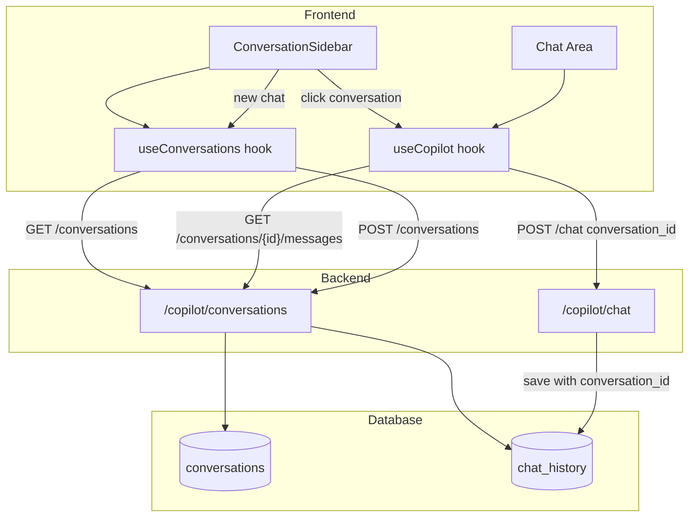

# ChatGPT-like Conversation UI

## What exists now (Day 8)
- Single-session chat (messages in React state, lost on page reload)
- Backend saves to `chat_history` but no grouping by conversation
- No way to access past chats
- No sidebar

## What gets added

### 1. Database Layer (1 new migration)

**New file: `akara/migrations/007_conversations.sql`**

```sql
-- conversations table
CREATE TABLE IF NOT EXISTS public.conversations (
    id          UUID        PRIMARY KEY DEFAULT uuid_generate_v4(),
    tenant_id   UUID        NOT NULL REFERENCES public.tenants(id) ON DELETE CASCADE,
    user_id     UUID        NOT NULL REFERENCES auth.users(id) ON DELETE CASCADE,
    title       TEXT        NOT NULL DEFAULT 'New Chat',
    created_at  TIMESTAMPTZ NOT NULL DEFAULT NOW(),
    updated_at  TIMESTAMPTZ NOT NULL DEFAULT NOW()
);

CREATE INDEX idx_conversations_user_id ON public.conversations (user_id);
CREATE INDEX idx_conversations_tenant_id ON public.conversations (tenant_id);
CREATE INDEX idx_conversations_updated_at ON public.conversations (updated_at DESC);

-- Add conversation_id to chat_history
ALTER TABLE public.chat_history 
ADD COLUMN conversation_id UUID REFERENCES public.conversations(id) ON DELETE CASCADE;

CREATE INDEX idx_chat_history_conversation_id ON public.chat_history (conversation_id);

-- RLS for conversations
ALTER TABLE public.conversations ENABLE ROW LEVEL SECURITY;

CREATE POLICY "conversations_select"
    ON public.conversations FOR SELECT
    USING (user_id = auth.uid() AND tenant_id = (SELECT tenant_id FROM auth.users WHERE id = auth.uid()));

CREATE POLICY "conversations_insert"
    ON public.conversations FOR INSERT
    WITH CHECK (user_id = auth.uid() AND tenant_id = (SELECT tenant_id FROM auth.users WHERE id = auth.uid()));

CREATE POLICY "conversations_update"
    ON public.conversations FOR UPDATE
    USING (user_id = auth.uid());

CREATE POLICY "conversations_delete"
    ON public.conversations FOR DELETE
    USING (user_id = auth.uid());
```

### 2. Backend API (5 new endpoints + 1 modified)

**New file: `backend/app/api/routes/conversations.py`**

```python
from datetime import datetime
from uuid import UUID

from fastapi import APIRouter, HTTPException, status
from pydantic import BaseModel

from app.core.auth import CurrentUser
from app.core.tenant import TenantCtx, get_supabase_service_client

router = APIRouter(prefix="/copilot/conversations", tags=["copilot"])


class ConversationOut(BaseModel):
    id: UUID
    title: str
    created_at: datetime
    updated_at: datetime
    message_count: int = 0


class ConversationCreate(BaseModel):
    title: str = "New Chat"


class ConversationUpdate(BaseModel):
    title: str


class MessageOut(BaseModel):
    id: UUID
    role: str  # "user" or "assistant"
    content: str
    created_at: datetime


@router.get("/", response_model=list[ConversationOut])
def list_conversations(
    user: CurrentUser,
    tenant: TenantCtx,
) -> list[ConversationOut]:
    """List all conversations for the current user, sorted by most recent."""
    supabase = get_supabase_service_client()
    
    # Get conversations with message counts
    result = supabase.rpc(
        "get_conversations_with_counts",
        {"p_user_id": str(user.user_id)}
    ).execute()
    
    return [ConversationOut(**row) for row in (result.data or [])]


@router.post("/", response_model=ConversationOut, status_code=status.HTTP_201_CREATED)
def create_conversation(
    body: ConversationCreate,
    user: CurrentUser,
    tenant: TenantCtx,
) -> ConversationOut:
    """Create a new conversation."""
    supabase = get_supabase_service_client()
    result = (
        supabase.table("conversations")
        .insert({
            "tenant_id": str(tenant.tenant_id),
            "user_id": str(user.user_id),
            "title": body.title,
        })
        .execute()
    )
    conv = result.data[0]
    return ConversationOut(**conv, message_count=0)


@router.get("/{conversation_id}/messages", response_model=list[MessageOut])
def get_conversation_messages(
    conversation_id: UUID,
    user: CurrentUser,
    tenant: TenantCtx,
) -> list[MessageOut]:
    """Load all messages for a conversation."""
    supabase = get_supabase_service_client()
    
    # Verify ownership
    conv_check = (
        supabase.table("conversations")
        .select("id")
        .eq("id", str(conversation_id))
        .eq("user_id", str(user.user_id))
        .execute()
    )
    if not conv_check.data:
        raise HTTPException(status_code=404, detail="Conversation not found")
    
    # Get messages
    result = (
        supabase.table("chat_history")
        .select("id, question, response, created_at")
        .eq("conversation_id", str(conversation_id))
        .order("created_at", desc=False)
        .execute()
    )
    
    messages = []
    for row in result.data or []:
        messages.append(MessageOut(
            id=row["id"],
            role="user",
            content=row["question"],
            created_at=row["created_at"],
        ))
        if row["response"]:
            messages.append(MessageOut(
                id=f"{row['id']}-assistant",
                role="assistant",
                content=row["response"],
                created_at=row["created_at"],
            ))
    
    return messages


@router.patch("/{conversation_id}", response_model=ConversationOut)
def update_conversation(
    conversation_id: UUID,
    body: ConversationUpdate,
    user: CurrentUser,
    tenant: TenantCtx,
) -> ConversationOut:
    """Rename a conversation."""
    supabase = get_supabase_service_client()
    result = (
        supabase.table("conversations")
        .update({"title": body.title, "updated_at": "NOW()"})
        .eq("id", str(conversation_id))
        .eq("user_id", str(user.user_id))
        .execute()
    )
    if not result.data:
        raise HTTPException(status_code=404, detail="Conversation not found")
    
    conv = result.data[0]
    return ConversationOut(**conv, message_count=0)


@router.delete("/{conversation_id}", status_code=status.HTTP_204_NO_CONTENT)
def delete_conversation(
    conversation_id: UUID,
    user: CurrentUser,
    tenant: TenantCtx,
) -> None:
    """Delete a conversation and all its messages."""
    supabase = get_supabase_service_client()
    result = (
        supabase.table("conversations")
        .delete()
        .eq("id", str(conversation_id))
        .eq("user_id", str(user.user_id))
        .execute()
    )
    if not result.data:
        raise HTTPException(status_code=404, detail="Conversation not found")
```

**Add RPC function to migration 007:**
```sql
-- Helper function for listing conversations with message counts
CREATE OR REPLACE FUNCTION get_conversations_with_counts(p_user_id UUID)
RETURNS TABLE (
    id UUID,
    title TEXT,
    created_at TIMESTAMPTZ,
    updated_at TIMESTAMPTZ,
    message_count BIGINT
) AS $$
BEGIN
    RETURN QUERY
    SELECT 
        c.id,
        c.title,
        c.created_at,
        c.updated_at,
        COALESCE(COUNT(ch.id), 0) as message_count
    FROM public.conversations c
    LEFT JOIN public.chat_history ch ON ch.conversation_id = c.id
    WHERE c.user_id = p_user_id
    GROUP BY c.id, c.title, c.created_at, c.updated_at
    ORDER BY c.updated_at DESC;
END;
$$ LANGUAGE plpgsql SECURITY DEFINER;
```

**Modify: [`backend/app/api/routes/copilot.py`](akara/backend/app/api/routes/copilot.py)**
- Add `conversation_id: UUID | None` to `ChatRequest`
- Pass `conversation_id` when saving to `chat_history`
- Auto-create conversation if `conversation_id` is None
- Auto-generate title from first message using first 50 chars

**Register router in [`backend/app/main.py`](akara/backend/app/main.py):**
```python
from app.api.routes import conversations as conversations_router
app.include_router(conversations_router.router)
```

### 3. Frontend Components (4 new files + 2 modified)

**New file: `frontend/src/hooks/useConversations.ts`**
```typescript
import { useState, useEffect, useCallback } from "react";
import { supabase } from "@/lib/supabase";

export interface Conversation {
  id: string;
  title: string;
  created_at: string;
  updated_at: string;
  message_count: number;
}

const BASE = import.meta.env.VITE_API_BASE_URL as string;

export function useConversations() {
  const [conversations, setConversations] = useState<Conversation[]>([]);
  const [loading, setLoading] = useState(true);

  const fetchConversations = useCallback(async () => {
    const { data } = await supabase.auth.getSession();
    const token = data.session?.access_token;
    if (!token) return;

    const res = await fetch(`${BASE}/copilot/conversations`, {
      headers: { Authorization: `Bearer ${token}` },
    });
    if (res.ok) {
      const data = await res.json();
      setConversations(data);
    }
    setLoading(false);
  }, []);

  const createConversation = useCallback(async (title = "New Chat") => {
    const { data } = await supabase.auth.getSession();
    const token = data.session?.access_token;
    if (!token) return null;

    const res = await fetch(`${BASE}/copilot/conversations`, {
      method: "POST",
      headers: {
        "Content-Type": "application/json",
        Authorization: `Bearer ${token}`,
      },
      body: JSON.stringify({ title }),
    });
    if (res.ok) {
      const newConv = await res.json();
      setConversations((prev) => [newConv, ...prev]);
      return newConv;
    }
    return null;
  }, []);

  const renameConversation = useCallback(async (id: string, title: string) => {
    const { data } = await supabase.auth.getSession();
    const token = data.session?.access_token;
    if (!token) return;

    const res = await fetch(`${BASE}/copilot/conversations/${id}`, {
      method: "PATCH",
      headers: {
        "Content-Type": "application/json",
        Authorization: `Bearer ${token}`,
      },
      body: JSON.stringify({ title }),
    });
    if (res.ok) {
      const updated = await res.json();
      setConversations((prev) =>
        prev.map((c) => (c.id === id ? updated : c))
      );
    }
  }, []);

  const deleteConversation = useCallback(async (id: string) => {
    const { data } = await supabase.auth.getSession();
    const token = data.session?.access_token;
    if (!token) return;

    const res = await fetch(`${BASE}/copilot/conversations/${id}`, {
      method: "DELETE",
      headers: { Authorization: `Bearer ${token}` },
    });
    if (res.ok) {
      setConversations((prev) => prev.filter((c) => c.id !== id));
    }
  }, []);

  useEffect(() => {
    fetchConversations();
  }, [fetchConversations]);

  return {
    conversations,
    loading,
    createConversation,
    renameConversation,
    deleteConversation,
    refetch: fetchConversations,
  };
}
```

**New file: `frontend/src/components/copilot/ConversationSidebar.tsx`**
- Left sidebar (280px width, fixed)
- "New Chat" button at top
- Scrollable conversation list below
- Each conversation item shows title, click to switch
- Hover: show rename/delete icons
- Active conversation highlighted

**New file: `frontend/src/components/copilot/ConversationItem.tsx`**
- Single conversation row
- Title (editable on click or via pencil icon)
- Delete button (with confirmation)
- Active state styling

**Modify: [`frontend/src/hooks/useCopilot.ts`](akara/frontend/src/hooks/useCopilot.ts)**
- Add `conversationId` state
- Add `loadConversation(id)` method to fetch messages
- Add `startNewConversation()` to clear messages
- Pass `conversation_id` in POST /copilot/chat body
- Auto-create conversation on first message if none exists

**Modify: [`frontend/src/pages/CopilotPage.tsx`](akara/frontend/src/pages/CopilotPage.tsx)**
- Change layout from single column to 2-column (sidebar + chat)
- Import and render `ConversationSidebar`
- Pass conversation switching handlers
- Show "New Chat" button in header when conversation exists

## Data Flow



## Auto-title Generation Logic

When first message is sent in a new conversation:
1. Backend extracts first 50 chars of question
2. Updates conversation title to that snippet
3. Frontend refetches conversation list to show updated title

## Quality Gate
```bash
cd akara/backend && uv run ruff check . && uv run pytest -q
```
