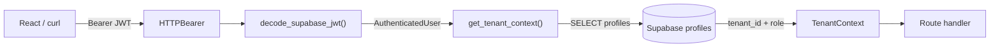

# Day 2 — FastAPI Core

**Goal:** FastAPI boots locally, `/health` returns 200, JWT middleware validates Supabase tokens, and `TenantContext` resolves `tenant_id` from the `profiles` table.

**Prerequisites:**
- Day 1 complete — schema applied in Supabase, `backend/` scaffold exists, `uv` env initialized
- `.env` filled with real Supabase URL, anon key, service role key, and JWT secret

---

## Request flow after Day 2



---

## Step 1 — `backend/app/core/config.py` (new file)

Pydantic `Settings` class. Reads all values from `.env` at startup and raises a `ValidationError` immediately if any required var is missing. Replaces ad-hoc `os.environ` calls everywhere.

Key fields: `supabase_url`, `supabase_anon_key`, `supabase_service_role_key`, `jwt_secret`, `jwt_algorithm = "HS256"`, `gemini_api_key`, `openrouter_api_key`, `gmail_user`, `gmail_app_password`, `environment`, `log_level`, `allowed_origins`, `sentry_dsn`.

`allowed_origins` has a validator that splits a comma-separated string into a list (needed for Railway env vars which don't support arrays). A `is_production` property returns `environment == "production"`.

Module-level singleton: `settings = Settings()` — imported everywhere as `from app.core.config import settings`.

---

## Step 2 — `backend/app/core/auth.py` (new file)

JWT verification and FastAPI dependency.

Three objects:
- `TokenPayload` — Pydantic model for the decoded JWT claims (`sub`, `email`, `role`, `aud`)
- `AuthenticatedUser` — cleaner model returned to route handlers (`user_id: UUID`, `email`, `role`)
- `get_current_user` — FastAPI dependency that calls `HTTPBearer()` to extract the `Authorization: Bearer <token>` header, decodes it with `python-jose`, and returns `AuthenticatedUser`. Raises `HTTP 401` on any JWT error.

Type alias: `CurrentUser = Annotated[AuthenticatedUser, Depends(get_current_user)]` — routes declare `user: CurrentUser` in their signature.

---

## Step 3 — `backend/app/core/tenant.py` (new file)

Tenant context resolution and Supabase client factories.

Two client factories:
- `get_supabase_service_client()` — uses `service_role_key`, bypasses RLS. Used for admin operations and tenant lookups.
- `get_supabase_anon_client()` — uses `anon_key`, respects RLS. Used for user-scoped queries.

`TenantContext` class holds `tenant_id: UUID`, `role: str`, `user_id: UUID`, and an `is_admin` property.

`get_tenant_context` dependency chains off `get_current_user`: takes the resolved `user_id`, queries `profiles` table with the service client, returns `TenantContext`. Raises `HTTP 403` if the profile row doesn't exist.

Type alias: `TenantCtx = Annotated[TenantContext, Depends(get_tenant_context)]`

---

## Step 4 — `backend/app/api/routes/health.py` (new file)

Replaces the inline `/health` from the Day 1 stub.

`HealthResponse` Pydantic model: `status: str`, `environment: str`, `timestamp: str`.

`GET /health` returns `HealthResponse` — no auth required, used by UptimeRobot and Railway health checks.

---

## Step 5 — `backend/app/api/routes/auth.py` (new file)

`GET /auth/me` — protected endpoint used by the React frontend on every page load to confirm the token is valid and get the user's tenant context.

`MeResponse` model: `user_id: UUID`, `email`, `tenant_id: UUID`, `role`.

Depends on both `CurrentUser` and `TenantCtx`.

---

## Step 6 — `backend/app/main.py` (full replacement)

Replace the 8-line Day 1 stub with the full application:

- `logging.basicConfig(level=settings.log_level)`
- Sentry init guarded by `if settings.sentry_dsn:` (no-op today, active Day 10)
- `FastAPI(title=..., docs_url="/docs" if not settings.is_production else None)` — hides Swagger in production
- `CORSMiddleware` with `allow_origins=settings.allowed_origins`
- `app.include_router(health.router)`
- `app.include_router(auth_router.router)`

---

## Step 7 — `backend/run.sh` (new file)

```bash
#!/usr/bin/env bash
set -euo pipefail
uv run uvicorn app.main:app --host 0.0.0.0 --port 8000 --reload
```

`chmod +x backend/run.sh` after creation.

---

## Step 8 — `backend/tests/test_health.py` (new file)

Two tests:
- `test_health_returns_200` — asserts status 200, `data["status"] == "ok"`, `"timestamp"` in response
- `test_health_returns_environment` — asserts environment is one of `"development"`, `"production"`, `"staging"`

---

## Step 9 — Verify

```bash
# Start server
cd backend && ./run.sh

# Health check
curl -s http://localhost:8000/health | python3 -m json.tool
# Expected: {"status":"ok","environment":"development","timestamp":"..."}

# Swagger UI
open http://localhost:8000/docs

# Auth without token — should 403
curl -s -o /dev/null -w "%{http_code}" http://localhost:8000/auth/me
# Expected: 403

# Run tests
uv run pytest tests/test_health.py -v
# Expected: 2 passed
```

---

## Step 10 — Local quality gate

```bash
ruff check .
pytest
```

---

## Supabase connections on Day 2

| Action | Table | Operation | Client key |
|---|---|---|---|
| Tenant lookup in `get_tenant_context` | `profiles` | `SELECT tenant_id, role WHERE id = user_id` | service role (bypasses RLS) |
| JWT validation | — | Decode with `JWT_SECRET` — no network call | — |

---

## End-of-day checklist

- [ ] `backend/app/core/config.py` exists — `Settings()` loads without error
- [ ] `backend/app/core/auth.py` exists — `get_current_user` dependency works
- [ ] `backend/app/core/tenant.py` exists — `get_tenant_context` dependency works
- [ ] `backend/app/api/routes/health.py` exists
- [ ] `backend/app/api/routes/auth.py` exists
- [ ] `backend/app/main.py` replaced — CORS and both routers registered
- [ ] `backend/run.sh` exists and is executable
- [ ] `backend/tests/test_health.py` — 2 tests pass
- [ ] `GET /health` returns 200 with `status`, `environment`, `timestamp`
- [ ] `GET /auth/me` without token returns 403
- [ ] `ruff check .` exits 0
- [ ] `pytest` exits 0 (2 tests pass)
