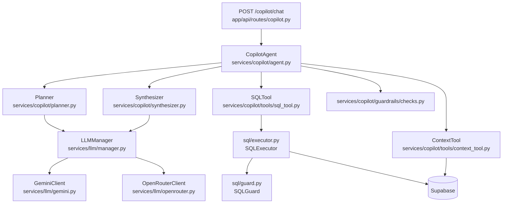

# Day 3 — Port Copilot Core

**Goal:** The `POST /copilot/chat` endpoint accepts a question and returns a streaming SSE response (or a full JSON response). Every layer is independently testable. `ruff check .` and `pytest` both exit 0.

---

## Architecture after Day 3



---

## Files to create (17 new) + 1 modified

### 3.1 — LLM layer (`backend/app/services/llm/`)

**[`services/llm/gemini.py`](akara/backend/app/services/llm/gemini.py)** — Created
- `GeminiClient` wraps `google-generativeai`. Model: `gemini-2.5-flash`.
- `async complete(prompt, system) -> str`
- `async stream(prompt, system) -> AsyncGenerator[str, None]`
- Simulates system prompt by prepending a user/model exchange (Gemini doesn't have a native system role).

**[`services/llm/openrouter.py`](akara/backend/app/services/llm/openrouter.py)** — Created
- `OpenRouterClient` calls OpenRouter REST API via `httpx`.
- Model: `anthropic/claude-3-haiku`. Timeout: 60s.
- Parses SSE `data:` lines for streaming.

**[`services/llm/manager.py`](akara/backend/app/services/llm/manager.py)** — Created
- `LLMManager` owns one `GeminiClient` and one `OpenRouterClient`.
- `async complete(prompt, system)` — tries Gemini first, falls back to OpenRouter on any exception.
- `async stream(prompt, system)` — same failover, yields text chunks.
- `LLMProvider` enum tracks which provider is currently active.

---

### 3.2 — SQL layer (`backend/app/sql/`)

**[`sql/guard.py`](akara/backend/app/sql/guard.py)** — Created
- `SQLGuardError(ValueError)` — raised on policy violation.
- `validate_sql(query)` — enforces:
  - Must start with `SELECT`
  - No `INSERT/UPDATE/DELETE/DROP/CREATE/ALTER/TRUNCATE/GRANT/REVOKE/EXECUTE/COPY`
  - No `pg_catalog`, `information_schema`, `pg_toast`
  - No `pg_read_file`, `pg_ls_dir`, `pg_sleep`, `lo_import`, `lo_export`, `dblink`

**[`sql/executor.py`](akara/backend/app/sql/executor.py)** — Created
- `SQLExecutor(client: Client)` — wraps Supabase RPC `execute_tenant_query`.
- Calls `validate_sql` before every execution.
- Hard cap of 2000 rows returned.

---

### 3.3 — Guardrails (`backend/app/services/copilot/guardrails/`)

**[`guardrails/checks.py`](akara/backend/app/services/copilot/guardrails/checks.py)** — Created
- `GuardrailResult` dataclass — `passed`, `check_name`, `message`.
- Five checks: `premise_check`, `numeric_digest`, `numeric_postcheck`, `causal_postcheck`, `data_scope_check`.
- `run_all_guardrails(...)` — runs all five, returns `list[GuardrailResult]`.

---

### 3.4 — Tools (`backend/app/services/copilot/tools/`)

**[`tools/sql_tool.py`](akara/backend/app/services/copilot/tools/sql_tool.py)** — Created
- `SQLTool(executor, tenant_id)` — wraps `SQLExecutor`, catches `SQLGuardError` and `RuntimeError`, returns structured `dict`.

**[`tools/context_tool.py`](akara/backend/app/services/copilot/tools/context_tool.py)** — Created
- `ContextTool(supabase, tenant_id)` — reads `context_cache` table for weather/news/holiday data.

---

### 3.5 — Planner (`backend/app/services/copilot/planner.py`)

**[`copilot/planner.py`](akara/backend/app/services/copilot/planner.py)** — Created
- `Planner(llm: LLMManager)` — sends user question + schema context to LLM with a strict JSON system prompt.
- `async plan(question, schema_context, date_range) -> Plan`
- `Plan` and `PlanStep` dataclasses — hold intent, steps (each with `step_id`, `description`, `sql`), `requires_context`, `response_format`.
- `_parse_plan(raw)` — regex-extracts JSON, parses with `json.loads`.

---

### 3.6 — Synthesizer (`backend/app/services/copilot/synthesizer.py`)

**[`copilot/synthesizer.py`](akara/backend/app/services/copilot/synthesizer.py)** — Created
- `Synthesizer(llm: LLMManager)`
- `async synthesize(question, sql_results, context_data, intent) -> str` — non-streaming.
- `async synthesize_stream(...) -> AsyncGenerator[str, None]` — streaming.
- Caps SQL results at 100 rows before including in prompt.

---

### 3.7 — Agent orchestrator (`backend/app/services/copilot/agent.py`)

**[`copilot/agent.py`](akara/backend/app/services/copilot/agent.py)** — Created
- `CopilotAgent(planner, synthesizer, sql_tool, context_tool, tenant_id)` — fully dependency-injected, no global state.
- `async answer(...)` → `CopilotResponse` — runs Plan→Execute→Synthesize, then runs all guardrails and appends warning notes to response for any failed check.
- `async answer_stream(...)` → `AsyncGenerator[str, None]` — streaming version (no guardrails appended in stream path).
- `CopilotResponse` dataclass captures: `question`, `intent`, `response`, `sql_queries_run`, `llm_model`, `tokens_used`, `guardrail_results`, `response_time_ms`.

---

### 3.8 — Copilot API route (`backend/app/api/routes/copilot.py`)

**[`api/routes/copilot.py`](akara/backend/app/api/routes/copilot.py)** — Created
- `ChatRequest` model: `question: str`, `stream: bool = True`.
- `ChatResponse` model: `question`, `intent`, `response`, `response_time_ms`, `llm_model`.
- `_build_agent(tenant_id)` factory — wires all dependencies.
- `POST /copilot/chat` — protected (`CurrentUser` + `TenantCtx`).
  - If `stream=True` → returns `StreamingResponse` with SSE `text/event-stream`. Each chunk: `data: <text>\n\n`. Ends with `data: [DONE]\n\n`.
  - If `stream=False` → returns `ChatResponse` JSON.
- Schema context and `available_columns` are hardcoded for now (Day 4 will replace with dynamic schema discovery).

---

### Modified: [`backend/app/main.py`](akara/backend/app/main.py)

Add two lines after the existing router includes:
```python
from app.api.routes import copilot as copilot_router
app.include_router(copilot_router.router)
```

---

## Supabase connections on Day 3

- `context_cache` — `SELECT` via service role client (in `ContextTool`)
- `sales_data` — `SELECT` via `execute_tenant_query` RPC (in `SQLExecutor`)

No new SQL migrations needed. The `execute_tenant_query` RPC is called but its absence won't prevent import or server boot — it will fail only at query execution time.

---

## Verification steps

```bash
cd akara/backend

# 1. Server boots without import errors
./run.sh

# 2. SQL guard — inline smoke test
uv run python -c "
from app.sql.guard import validate_sql, SQLGuardError
validate_sql('SELECT * FROM sales_data')
print('SELECT: OK')
try:
    validate_sql('DELETE FROM sales_data')
except SQLGuardError:
    print('DELETE blocked: OK')
"

# 3. Guardrails — numeric postcheck
uv run python -c "
from app.services.copilot.guardrails.checks import numeric_postcheck
print(numeric_postcheck('Revenue was 500 crore'))
print(numeric_postcheck('Revenue was 99999999999 billion'))
"

# 4. Quality gate
ruff check .
pytest
```

---

## Todos

- Create `services/llm/gemini.py` — GeminiClient
- Create `services/llm/openrouter.py` — OpenRouterClient
- Create `services/llm/manager.py` — LLMManager with failover
- Create `sql/guard.py` — SQLGuard + validate_sql
- Create `sql/executor.py` — SQLExecutor
- Create `guardrails/checks.py` — 5 checks + run_all_guardrails
- Create `tools/sql_tool.py` — SQLTool
- Create `tools/context_tool.py` — ContextTool
- Create `copilot/planner.py` — Planner + Plan/PlanStep dataclasses
- Create `copilot/synthesizer.py` — Synthesizer (sync + streaming)
- Create `copilot/agent.py` — CopilotAgent orchestrator
- Create `api/routes/copilot.py` — POST /copilot/chat endpoint
- Modify `main.py` — register copilot router
- Verify: server boots, SQL guard tests pass, ruff + pytest exit 0
