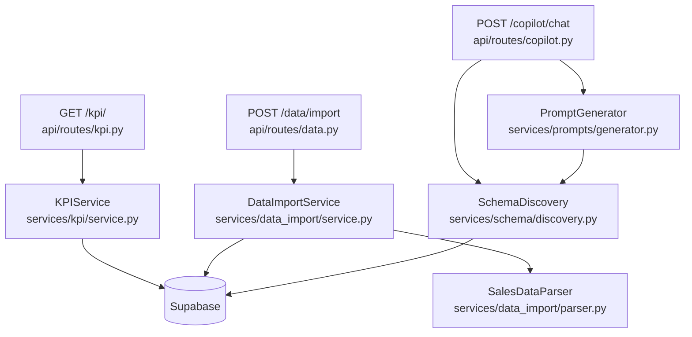

# Day 4 — Port KPI + Data Services

**Goal:** `GET /kpi/` returns computed metrics from `sales_data`, `POST /data/import` accepts CSV/XLSX uploads and batch-inserts rows, schema discovery builds dynamic LLM context, and the prompts generator wires them together. `ruff check .` and `pytest` both exit 0.

---

## Current State

Day 3 is complete. The following `__init__.py` stubs already exist (created during scaffold):
- `services/kpi/__init__.py`
- `services/data_import/__init__.py`
- `services/schema/__init__.py`
- `services/prompts/__init__.py`

The `get_kpi_summary` Supabase RPC is already defined in [`akara/migrations/003_functions.sql`](akara/migrations/003_functions.sql).

No new SQL migrations are needed.

---

## Architecture after Day 4



---

## Files to Create (9 new) + 2 Modified

### 4.1 — KPI Service (`backend/app/services/kpi/`)

- **[`services/kpi/models.py`](akara/backend/app/services/kpi/models.py)** — Pydantic models: `KPISummary`, `TopProduct`, `ZoneBreakdown`, `RevenueByDate`, `KPIResponse`
- **[`services/kpi/service.py`](akara/backend/app/services/kpi/service.py)** — `KPIService(supabase)` with four methods:
  - `get_summary` — calls `get_kpi_summary` Supabase RPC
  - `get_top_products` — SELECT aggregation on `sales_data`
  - `get_zone_breakdown` — SELECT with revenue_pct computed locally
  - `get_revenue_trend` — SELECT grouped by `invoice_date`
  - `get_all` — composes all four into `KPIResponse`

### 4.2 — KPI API Route

- **[`api/routes/kpi.py`](akara/backend/app/api/routes/kpi.py)** — `GET /kpi/` with `start_date`/`end_date` query params, protected by `CurrentUser` + `TenantCtx`, defaults to last 30 days

### 4.3 — Data Import Service (`backend/app/services/data_import/`)

- **[`services/data_import/models.py`](akara/backend/app/services/data_import/models.py)** — `ImportResult(rows_inserted, rows_skipped, errors, warnings)`
- **[`services/data_import/parser.py`](akara/backend/app/services/data_import/parser.py)** — `SalesDataParser` with column alias normalisation, required-column validation, date/numeric coercion; supports `.csv`, `.xlsx`, `.xls`
- **[`services/data_import/service.py`](akara/backend/app/services/data_import/service.py)** — `DataImportService(supabase)` batches 500 rows per insert, enriches each row with `tenant_id`

### 4.4 — Data Import API Route

- **[`api/routes/data.py`](akara/backend/app/api/routes/data.py)** — `POST /data/import` (admin-only, 50 MB cap, CSV/XLSX content-type guard)

### 4.5 — Schema Discovery (`backend/app/services/schema/`)

- **[`services/schema/discovery.py`](akara/backend/app/services/schema/discovery.py)** — `SchemaDiscovery(supabase)`:
  - `get_columns()` — returns the 16 allowed `sales_data` column names
  - `get_distinct_values(tenant_id, column, limit=50)` — safe SELECT with allow-list guard
  - `get_schema_context(tenant_id)` — builds LLM-ready string with zones + categories

### 4.6 — Prompts Generator (`backend/app/services/prompts/`)

- **[`services/prompts/generator.py`](akara/backend/app/services/prompts/generator.py)** — `PromptGenerator(schema_discovery)`:
  - `build_system_prompt(tenant_id, tenant_name, start_date, end_date)` — injects today's date, available date range, and full schema context

### Modified: [`backend/app/main.py`](akara/backend/app/main.py)

Register two new routers after the existing includes:
```python
from app.api.routes import kpi as kpi_router
from app.api.routes import data as data_router
app.include_router(kpi_router.router)
app.include_router(data_router.router)
```

### Modified: [`backend/app/api/routes/copilot.py`](akara/backend/app/api/routes/copilot.py)

Replace hardcoded `schema_context` and `available_columns` strings in `_build_agent()` with a live call to `SchemaDiscovery.get_schema_context(tenant_id)` and `SchemaDiscovery.get_columns()`.

---

## Supabase Connections — Day 4

- `get_kpi_summary` RPC — already defined in `003_functions.sql`, no new migration needed
- `sales_data` SELECT (top products, zone breakdown, revenue trend, schema discovery)
- `sales_data` INSERT (data import, batched 500 rows)

---

## Verification Steps

```bash
cd akara/backend

# 1. Server boots clean
uv run uvicorn app.main:app --reload &

# 2. Parser smoke test (no Supabase needed)
uv run python -c "
from app.services.data_import.parser import SalesDataParser
import io, csv
rows = [['invoice_date','party_name','total_amount'],['2024-01-15','ABC',1500]]
buf = io.BytesIO()
buf.write(b'invoice_date,party_name,total_amount\n2024-01-15,ABC,1500\n')
df = SalesDataParser().parse(buf.getvalue(), 'test.csv')
print('rows:', len(df), 'cols:', list(df.columns))
"

# 3. Schema discovery (no Supabase needed for column list)
uv run python -c "
from app.services.schema.discovery import SchemaDiscovery
cols = SchemaDiscovery(None).get_columns()
print('columns:', len(cols), cols[:3])
"

# 4. Quality gate
ruff check .
pytest
```
