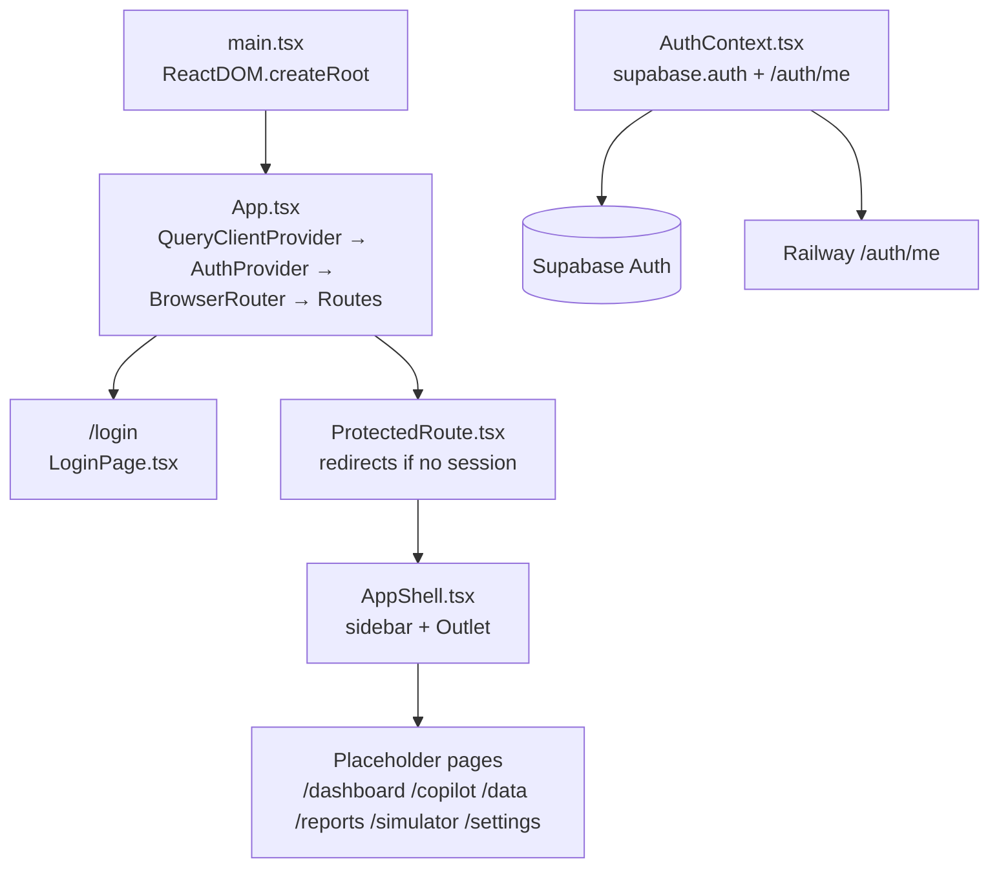

# Day 6 — React Scaffold + Supabase Auth + Deploy to Vercel

**Goal:** React frontend live on Vercel. Users can log in with Supabase Auth (email/password), the auth session is available app-wide via context, and all protected routes redirect unauthenticated users to `/login`. `pnpm build` exits 0.

---

## Current State

Day 5 complete. Inside `akara/frontend/`:

**Already in place (from Day 2 scaffold):**
- `src/lib/supabase.ts` — Supabase anon client
- `src/lib/utils.ts` — `cn()` helper
- `components.json` — shadcn configured (slate base, CSS variables, `@/` aliases)
- `vite.config.ts` + `tsconfig.app.json` — `@/` path alias wired
- All packages installed: `react`, `react-dom`, `react-router-dom` (v7), `@tanstack/react-query`, `@supabase/supabase-js`, `lucide-react`, `clsx`, `tailwind-merge`

**Not yet in place:**
- `src/App.tsx` is the Vite counter demo → **must be fully replaced**
- `src/main.tsx` → minor rewrite to match Day 6 import style
- No `src/types/`, `src/contexts/`, `src/pages/`, `src/components/layout/` directories
- `src/components/ui/` exists but is empty — shadcn components must be installed
- No `vercel.json`

---

## Architecture after Day 6



---

## Step 0 — Install shadcn Components (must run before writing code)

```bash
cd akara/frontend

# Track 1 — required by Login page
pnpm dlx shadcn@latest add button input label card

# Track 2 — required by TenantsPage
pnpm dlx shadcn@latest add table badge
```

Each command generates files into `src/components/ui/` and updates `src/index.css`. `lucide-react` is already in `package.json` — **do not re-install**.

---

## Files to Create (8 new) + 2 Modified

### 6.1 — Type definitions

**[`frontend/src/types/index.ts`](akara/frontend/src/types/index.ts)** — New file.

```typescript
export interface User {
  id: string;
  email: string;
  tenantId: string;
  role: "admin" | "user";
  displayName?: string;
}

export interface Tenant {
  id: string;
  name: string;
  slug: string;
  config: Record<string, unknown>;
  isActive: boolean;
}
```

---

### 6.2 — Auth Context

**[`frontend/src/contexts/AuthContext.tsx`](akara/frontend/src/contexts/AuthContext.tsx)** — New file. Wraps Supabase Auth and calls `GET /auth/me` to enrich the session with `tenant_id` and `role`.

```typescript
import React, {
  createContext,
  useContext,
  useEffect,
  useState,
  ReactNode,
} from "react";
import { Session, User as SupabaseUser } from "@supabase/supabase-js";
import { supabase } from "@/lib/supabase";
import { User } from "@/types";

interface AuthContextValue {
  session: Session | null;
  user: User | null;
  loading: boolean;
  signIn: (email: string, password: string) => Promise<void>;
  signOut: () => Promise<void>;
}

const AuthContext = createContext<AuthContextValue | null>(null);

export function AuthProvider({ children }: { children: ReactNode }) {
  const [session, setSession] = useState<Session | null>(null);
  const [user, setUser] = useState<User | null>(null);
  const [loading, setLoading] = useState(true);

  async function fetchProfile(supabaseUser: SupabaseUser, accessToken: string) {
    try {
      const res = await fetch(
        `${import.meta.env.VITE_API_BASE_URL}/auth/me`,
        { headers: { Authorization: `Bearer ${accessToken}` } }
      );
      if (!res.ok) throw new Error("Profile fetch failed");
      const data = await res.json();
      setUser({
        id: data.user_id,
        email: data.email,
        tenantId: data.tenant_id,
        role: data.role,
      });
    } catch {
      setUser(null);
    }
  }

  useEffect(() => {
    supabase.auth.getSession().then(({ data: { session } }) => {
      setSession(session);
      if (session?.user && session.access_token) {
        fetchProfile(session.user, session.access_token).finally(() =>
          setLoading(false)
        );
      } else {
        setLoading(false);
      }
    });

    const { data: { subscription } } = supabase.auth.onAuthStateChange(
      (_event, session) => {
        setSession(session);
        if (session?.user && session.access_token) {
          fetchProfile(session.user, session.access_token);
        } else {
          setUser(null);
        }
      }
    );

    return () => subscription.unsubscribe();
  }, []);

  async function signIn(email: string, password: string) {
    const { error } = await supabase.auth.signInWithPassword({ email, password });
    if (error) throw error;
  }

  async function signOut() {
    await supabase.auth.signOut();
    setUser(null);
  }

  return (
    <AuthContext.Provider value={{ session, user, loading, signIn, signOut }}>
      {children}
    </AuthContext.Provider>
  );
}

export function useAuth(): AuthContextValue {
  const ctx = useContext(AuthContext);
  if (!ctx) throw new Error("useAuth must be used within AuthProvider");
  return ctx;
}
```

---

### 6.3 — Protected Route

**[`frontend/src/components/ProtectedRoute.tsx`](akara/frontend/src/components/ProtectedRoute.tsx)** — New file.

```typescript
import { Navigate, Outlet } from "react-router-dom";
import { useAuth } from "@/contexts/AuthContext";

export function ProtectedRoute() {
  const { session, loading } = useAuth();

  if (loading) {
    return (
      <div className="flex h-screen items-center justify-center">
        <div className="animate-spin rounded-full h-8 w-8 border-b-2 border-slate-900" />
      </div>
    );
  }

  return session ? <Outlet /> : <Navigate to="/login" replace />;
}
```

---

### 6.4 — Login Page

**[`frontend/src/pages/LoginPage.tsx`](akara/frontend/src/pages/LoginPage.tsx)** — New file.

```typescript
import { useState } from "react";
import { useNavigate } from "react-router-dom";
import { useAuth } from "@/contexts/AuthContext";
import { Button } from "@/components/ui/button";
import { Input } from "@/components/ui/input";
import { Label } from "@/components/ui/label";
import {
  Card,
  CardContent,
  CardDescription,
  CardHeader,
  CardTitle,
} from "@/components/ui/card";

export function LoginPage() {
  const { signIn } = useAuth();
  const navigate = useNavigate();
  const [email, setEmail] = useState("");
  const [password, setPassword] = useState("");
  const [error, setError] = useState("");
  const [loading, setLoading] = useState(false);

  async function handleSubmit(e: React.FormEvent) {
    e.preventDefault();
    setError("");
    setLoading(true);
    try {
      await signIn(email, password);
      navigate("/dashboard");
    } catch (err: unknown) {
      setError(err instanceof Error ? err.message : "Login failed");
    } finally {
      setLoading(false);
    }
  }

  return (
    <div className="min-h-screen flex items-center justify-center bg-slate-50">
      <Card className="w-full max-w-md shadow-lg">
        <CardHeader className="space-y-1">
          <CardTitle className="text-2xl font-bold tracking-tight">
            AKARA
          </CardTitle>
          <CardDescription>
            Sign in to your analytics dashboard
          </CardDescription>
        </CardHeader>
        <CardContent>
          <form onSubmit={handleSubmit} className="space-y-4">
            <div className="space-y-2">
              <Label htmlFor="email">Email</Label>
              <Input
                id="email"
                type="email"
                placeholder="you@company.com"
                value={email}
                onChange={(e) => setEmail(e.target.value)}
                required
                autoComplete="email"
              />
            </div>
            <div className="space-y-2">
              <Label htmlFor="password">Password</Label>
              <Input
                id="password"
                type="password"
                value={password}
                onChange={(e) => setPassword(e.target.value)}
                required
                autoComplete="current-password"
              />
            </div>
            {error && (
              <p className="text-sm text-red-600 bg-red-50 p-2 rounded">
                {error}
              </p>
            )}
            <Button type="submit" className="w-full" disabled={loading}>
              {loading ? "Signing in..." : "Sign in"}
            </Button>
          </form>
        </CardContent>
      </Card>
    </div>
  );
}
```

---

### 6.5 — App Shell

**[`frontend/src/components/layout/AppShell.tsx`](akara/frontend/src/components/layout/AppShell.tsx)** — New file. Fixed 256 px sidebar with 6 nav links and a sign-out button; child pages render via `<Outlet />`.

```typescript
import { Link, useLocation, Outlet } from "react-router-dom";
import { useAuth } from "@/contexts/AuthContext";
import { Button } from "@/components/ui/button";
import {
  LayoutDashboard,
  MessageSquare,
  Upload,
  BarChart2,
  Settings,
  LogOut,
  TrendingUp,
} from "lucide-react";
import { cn } from "@/lib/utils";

const NAV_ITEMS = [
  { to: "/dashboard", label: "Dashboard", icon: LayoutDashboard },
  { to: "/copilot", label: "Copilot", icon: MessageSquare },
  { to: "/data", label: "Data", icon: Upload },
  { to: "/reports", label: "Reports", icon: BarChart2 },
  { to: "/simulator", label: "Simulator", icon: TrendingUp },
  { to: "/settings", label: "Settings", icon: Settings },
];

export function AppShell() {
  const { user, signOut } = useAuth();
  const location = useLocation();

  return (
    <div className="flex h-screen bg-slate-50">
      {/* Sidebar */}
      <aside className="w-64 bg-white border-r border-slate-200 flex flex-col">
        <div className="px-6 py-5 border-b border-slate-200">
          <span className="text-xl font-bold text-slate-900">AKARA</span>
          <p className="text-xs text-slate-500 mt-0.5 truncate">
            {user?.email}
          </p>
        </div>
        <nav className="flex-1 px-3 py-4 space-y-1">
          {NAV_ITEMS.map(({ to, label, icon: Icon }) => (
            <Link
              key={to}
              to={to}
              className={cn(
                "flex items-center gap-3 px-3 py-2 rounded-md text-sm font-medium transition-colors",
                location.pathname.startsWith(to)
                  ? "bg-slate-900 text-white"
                  : "text-slate-600 hover:bg-slate-100 hover:text-slate-900"
              )}
            >
              <Icon className="h-4 w-4" />
              {label}
            </Link>
          ))}
        </nav>
        <div className="px-3 py-4 border-t border-slate-200">
          <Button
            variant="ghost"
            size="sm"
            className="w-full justify-start gap-3 text-slate-600"
            onClick={signOut}
          >
            <LogOut className="h-4 w-4" />
            Sign out
          </Button>
        </div>
      </aside>
      {/* Main content */}
      <main className="flex-1 overflow-auto">
        <Outlet />
      </main>
    </div>
  );
}
```

---

### 6.6 — App.tsx (full replacement)

**[`frontend/src/App.tsx`](akara/frontend/src/App.tsx)** — **Modified** (full rewrite; Vite counter demo replaced entirely).

```typescript
import { BrowserRouter, Routes, Route, Navigate } from "react-router-dom";
import { QueryClient, QueryClientProvider } from "@tanstack/react-query";
import { AuthProvider } from "@/contexts/AuthContext";
import { ProtectedRoute } from "@/components/ProtectedRoute";
import { AppShell } from "@/components/layout/AppShell";
import { LoginPage } from "@/pages/LoginPage";

// Placeholder pages (built Days 7–10)
const Dashboard = () => <div className="p-8"><h1 className="text-2xl font-bold">Dashboard — coming Day 7</h1></div>;
const Copilot = () => <div className="p-8"><h1 className="text-2xl font-bold">Copilot — coming Day 8</h1></div>;
const Data = () => <div className="p-8"><h1 className="text-2xl font-bold">Data — coming Day 9</h1></div>;
const Reports = () => <div className="p-8"><h1 className="text-2xl font-bold">Reports — coming Day 10</h1></div>;
const Simulator = () => <div className="p-8"><h1 className="text-2xl font-bold">Simulator — coming Day 10</h1></div>;
const SettingsPage = () => <div className="p-8"><h1 className="text-2xl font-bold">Settings — coming Day 9</h1></div>;

const queryClient = new QueryClient({
  defaultOptions: {
    queries: { staleTime: 1000 * 60 * 5, retry: 2 },
  },
});

export default function App() {
  return (
    <QueryClientProvider client={queryClient}>
      <AuthProvider>
        <BrowserRouter>
          <Routes>
            <Route path="/login" element={<LoginPage />} />
            <Route element={<ProtectedRoute />}>
              <Route element={<AppShell />}>
                <Route path="/dashboard" element={<Dashboard />} />
                <Route path="/copilot" element={<Copilot />} />
                <Route path="/data" element={<Data />} />
                <Route path="/reports" element={<Reports />} />
                <Route path="/simulator" element={<Simulator />} />
                <Route path="/settings" element={<SettingsPage />} />
              </Route>
            </Route>
            <Route path="*" element={<Navigate to="/dashboard" replace />} />
          </Routes>
        </BrowserRouter>
      </AuthProvider>
    </QueryClientProvider>
  );
}
```

---

### 6.7 — main.tsx (minor rewrite)

**[`frontend/src/main.tsx`](akara/frontend/src/main.tsx)** — **Modified**.

```typescript
import React from "react";
import ReactDOM from "react-dom/client";
import App from "./App.tsx";
import "./index.css";

ReactDOM.createRoot(document.getElementById("root")!).render(
  <React.StrictMode>
    <App />
  </React.StrictMode>
);
```

---

### 6.8 — Vercel SPA rewrite config

**[`frontend/vercel.json`](akara/frontend/vercel.json)** — New file.

```json
{
  "rewrites": [
    { "source": "/(.*)", "destination": "/index.html" }
  ]
}
```

---

### 6.9 — Track 2: Admin Tenants Page

**[`frontend/src/pages/admin/TenantsPage.tsx`](akara/frontend/src/pages/admin/TenantsPage.tsx)** — New file. Calls `GET /admin/tenants` (Day 5 backend route).

```typescript
import { useQuery } from "@tanstack/react-query";
import { useAuth } from "@/contexts/AuthContext";
import { Button } from "@/components/ui/button";
import {
  Table,
  TableBody,
  TableCell,
  TableHead,
  TableHeader,
  TableRow,
} from "@/components/ui/table";
import { Badge } from "@/components/ui/badge";

interface Tenant {
  id: string;
  name: string;
  slug: string;
  is_active: boolean;
}

async function fetchTenants(token: string): Promise<Tenant[]> {
  const res = await fetch(
    `${import.meta.env.VITE_API_BASE_URL}/admin/tenants`,
    { headers: { Authorization: `Bearer ${token}` } }
  );
  if (!res.ok) throw new Error("Failed to fetch tenants");
  return res.json();
}

export function TenantsPage() {
  const { session } = useAuth();
  const { data: tenants, isLoading } = useQuery({
    queryKey: ["admin", "tenants"],
    queryFn: () => fetchTenants(session!.access_token),
    enabled: !!session,
  });

  if (isLoading) return <div className="p-8">Loading tenants...</div>;

  return (
    <div className="p-8 space-y-6">
      <h1 className="text-2xl font-bold">Tenants</h1>
      <Table>
        <TableHeader>
          <TableRow>
            <TableHead>Name</TableHead>
            <TableHead>Slug</TableHead>
            <TableHead>Status</TableHead>
            <TableHead>Actions</TableHead>
          </TableRow>
        </TableHeader>
        <TableBody>
          {(tenants || []).map((t) => (
            <TableRow key={t.id}>
              <TableCell>{t.name}</TableCell>
              <TableCell className="font-mono text-sm">{t.slug}</TableCell>
              <TableCell>
                <Badge variant={t.is_active ? "default" : "secondary"}>
                  {t.is_active ? "Active" : "Inactive"}
                </Badge>
              </TableCell>
              <TableCell>
                <Button variant="outline" size="sm">
                  Manage
                </Button>
              </TableCell>
            </TableRow>
          ))}
        </TableBody>
      </Table>
    </div>
  );
}
```

---

## Environment Variables

Set in Vercel dashboard → Project → Settings → Environment Variables (all environments):

| Variable | Purpose |
|---|---|
| `VITE_SUPABASE_URL` | Supabase project URL |
| `VITE_SUPABASE_ANON_KEY` | Supabase anon key (public) |
| `VITE_API_BASE_URL` | Railway backend URL, e.g. `https://akara-backend-production.up.railway.app` |

After getting the Vercel URL, update Railway's `ALLOWED_ORIGINS_RAW` to that domain and run `railway up`.

---

## Build & Deploy Commands

```bash
cd akara/frontend
pnpm dlx shadcn@latest add button input label card
pnpm dlx shadcn@latest add table badge
pnpm build          # must exit 0
vercel              # first deploy
vercel --prod       # after setting env vars
```

---

## Verification Checklist

- [ ] Vercel URL → redirects to `/login`
- [ ] Login form renders with shadcn Card styling
- [ ] Sign in with test user → lands on `/dashboard` (placeholder text visible)
- [ ] Sidebar shows all 6 nav links + logged-in email
- [ ] Sign out → redirects to `/login`
- [ ] Direct navigation to `/dashboard` while logged out → redirected to `/login`
- [ ] `cd akara/backend && uv run ruff check . && uv run pytest` both exit 0
