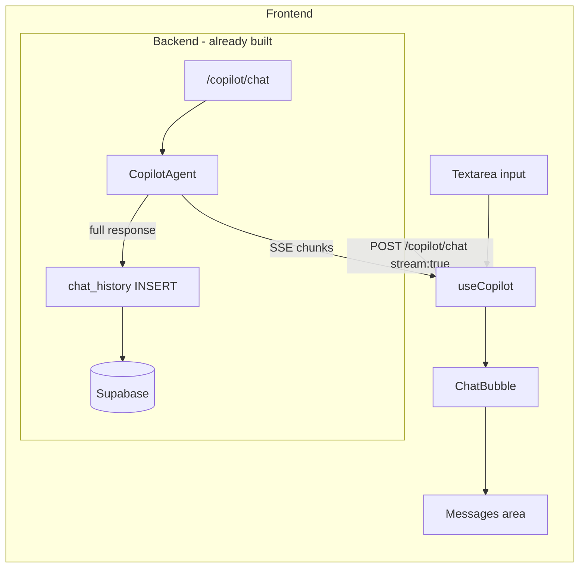

# Day 8 — Copilot Page (Chat UI + Streaming)

## What already exists (no changes)
- `/copilot/chat` backend endpoint with SSE streaming — fully working
- `chat_history` table, RLS policies, and indexes — migration 001 + 002
- `frontend/src/lib/supabase.ts` — auth token retrieval
- `frontend/src/lib/api.ts` + `frontend/src/lib/utils.ts`
- `shadcn/ui` button, input already installed
- `App.tsx` has `/copilot` route wired to a `<Copilot>` placeholder (lines 10–14, 52)

## What gets built

### Track 1 — Frontend (5 new files + 1 modified)

**1. `frontend/src/hooks/useCopilot.ts`** — SSE streaming state hook
- `ChatMessage` interface: `{ id, role, content, streaming?, error? }`
- `sendMessage()`: appends user + empty assistant bubble, opens `fetch()` stream to `POST /copilot/chat` with `stream: true`, reads SSE chunks (`data: <token>\n\n`), accumulates into the assistant bubble, marks `streaming: false` on `[DONE]`
- Error branch: sets `content = "Sorry, something went wrong."` and `error: true`
- Exposes `{ messages, isStreaming, sendMessage }`

**2. `frontend/src/components/copilot/ChatBubble.tsx`** — message bubble
- User messages: right-aligned, dark background
- Assistant messages: left-aligned, white card with border
- Error messages: red tint
- Streaming cursor: blinking indigo bar while `message.streaming === true`

**3. `frontend/src/components/copilot/SuggestedPrompts.tsx`** — click-to-fill chips
- 5 hardcoded prompts: top products, zone revenue, revenue trend, inactive parties, month-over-month
- `onSelect(prompt)` callback fills the input box

**4. `frontend/src/pages/CopilotPage.tsx`** — the full page
- 3-panel layout: fixed header / scrollable messages area / sticky input bar
- Empty state: greeting + `<SuggestedPrompts onSelect={setInput}>`
- Maps `messages` → `<ChatBubble>` with auto-scroll via `bottomRef`
- `<Textarea>` input: Enter to send, Shift+Enter for newline, disabled while streaming
- `<Button size="icon">` with `<Send>` icon from `lucide-react`

**5. `frontend/src/components/ui/textarea.tsx`** — shadcn Textarea
- Install via `npx shadcn@latest add textarea` (fallback: manual creation if pnpm unavailable, same pattern as the `select.tsx` gap fix)

**6. [`frontend/src/App.tsx`](akara/frontend/src/App.tsx) — replace placeholder**
- Remove the inline `const Copilot` placeholder (lines 10–14)
- Add `import { CopilotPage } from "@/pages/CopilotPage"`
- Replace `element={<Copilot />}` → `element={<CopilotPage />}`

### Track 2 — Backend (1 new file + 2 modified)

**7. `backend/app/api/routes/copilot.py`** — save chat history
- After the non-streaming `await agent.answer()` call, insert a row into `chat_history`:
  ```python
  supabase.table("chat_history").insert({
      "tenant_id": str(tenant.tenant_id),
      "user_id":   str(user.user_id),
      "question":  request.question,
      "response":  result.response,
      "metadata":  {
          "intent": result.intent,
          "response_time_ms": result.response_time_ms,
      },
  }).execute()
  ```
- Streaming path: history save is deferred to Day 9 (SSE stream finishes async; saving requires collecting the full response first)

**8. `backend/app/api/routes/admin/logs.py`** — audit log endpoint
- `GET /admin/logs/{tenant_id}` — paginated (`limit`, `offset` query params, max 500)
- `AuditLogEntry` Pydantic model matching the `audit_log` table schema
- Guarded by `_require_superadmin` (imported from `admin/tenants.py`)

**9. [`backend/app/main.py`](akara/backend/app/main.py)** — register logs router
```python
from app.api.routes.admin import logs as admin_logs_router
app.include_router(admin_logs_router.router)
```

## Data flow



## Verify
1. `/copilot` page loads — empty state + 5 suggested prompt chips visible
2. Click a chip → input box fills
3. Send → assistant bubble appears, streams word-by-word
4. Send second question → history accumulates (no page reset)
5. Supabase → `chat_history` table → row appears after non-streaming request
6. Kill network → error message appears, no crash
7. `ruff check . && pytest` — both pass

## Quality gate
```bash
cd akara/backend && uv run ruff check . && uv run pytest -q
```
