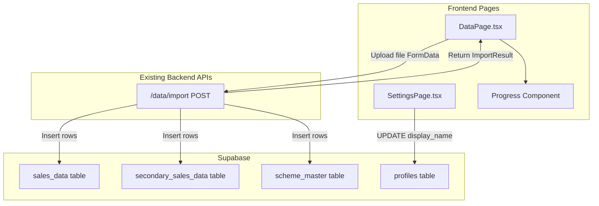
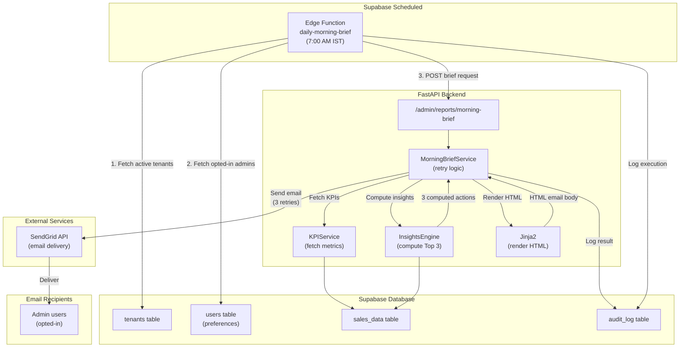

# Day 9 — Data Management + Settings Pages

## What Gets Built

### Track 1: Customer-Facing Pages (Priority)

#### 1. Data Management Page

Create [`frontend/src/pages/DataPage.tsx`](frontend/src/pages/DataPage.tsx) with:
- **3 upload panels** for different data sources:
  - Primary Sales (ERP/Tally dispatch invoices) → `sales_data` table
  - Secondary Sales (DMS offtake from Bizom/Botree) → `secondary_sales_data` table
  - Scheme Master (distributor claims) → `scheme_master` table
- **File upload UI** with drag-and-drop zone, file selection, size display
- **Progress bar** during upload with animated percentage
- **Result display** showing rows inserted, skipped, warnings, errors
- **Admin-only guard** — non-admin users see disabled UI with warning banner
- **Expected columns display** (collapsible) for each data source

**Integration:**
- POSTs to existing [`backend/app/api/routes/data.py`](backend/app/api/routes/data.py) `/data/import?source_type=primary|secondary|scheme` endpoint
- Backend already handles file validation, parsing, and tenant isolation
- Uses `FormData` to upload files with JWT auth

#### 2. Settings Page

Create [`frontend/src/pages/SettingsPage.tsx`](frontend/src/pages/SettingsPage.tsx) with:
- **Profile card** showing:
  - User avatar (first letter of email in circular badge)
  - Email address
  - Role badge (admin/viewer)
  - Display name input field (editable)
- **Account details card** showing:
  - Tenant ID (read-only)
  - User ID (read-only)
- **Save functionality** with:
  - Loading state during save
  - Success message (auto-hides after 3s)
  - Error handling with user-friendly messages

**Integration:**
- Direct Supabase update to `profiles` table using anon key (RLS-protected)
- Updates `display_name` column for current user

#### 3. UI Components

**Add Progress component:**
- Create [`frontend/src/components/ui/progress.tsx`](frontend/src/components/ui/progress.tsx) following shadcn/ui pattern
- Alternative: Install via `npm dlx shadcn@latest add progress` (if available)

#### 4. Routing Updates

Update [`frontend/src/App.tsx`](frontend/src/App.tsx):
- Remove placeholder `Data` and `SettingsPage` inline components
- Import real `DataPage` and `SettingsPage`
- Wire them into existing routes (`/data`, `/settings`)

### Track 2: Production-Grade Morning Brief System (MUST-HAVE)

#### 5. SendGrid Integration

**Add to [`backend/app/core/config.py`](backend/app/core/config.py):**
```python
# SendGrid (production email delivery)
sendgrid_api_key: str
sendgrid_from_email: str = "insights@akara.ai"
sendgrid_from_name: str = "AKARA Insights"
```

**Install SendGrid SDK:**
```bash
cd akara/backend
uv add sendgrid
```

#### 6. Insights Engine (Computed Actions)

Create [`backend/app/services/insights/engine.py`](backend/app/services/insights/engine.py):
- **InsightsEngine class** that computes Top 3 actions from actual data
- **Implemented insights:**
  1. **Inactive routes** — zones with routes that had zero orders in last 3 days (ranked by zone revenue)
  2. **Outstanding recovery** — parties with outstanding > 30 days (sorted by amount, top 10)
  3. **Product demand drops** — products with >15% week-over-week decline (sorted by revenue impact)
- **Revenue quantification** — each insight includes ₹ impact estimate
- **Returns:** `List[Insight]` where each insight has: `title`, `description`, `revenue_impact`, `priority`

**Data sources:**
- Queries `sales_data` for revenue, orders, routes
- Queries `sales_data.outstanding_amount` for collections
- Uses `get_route_performance()` SQL function (Day 1)
- Week-over-week comparison logic

#### 7. HTML Email Templates

Create [`backend/app/services/email/templates/morning_brief.html`](backend/app/services/email/templates/morning_brief.html):
- **Jinja2 template** with:
  - AKARA branding header (logo, colors: indigo/slate)
  - KPI summary cards (revenue, orders, parties, avg order)
  - Top 3 actions section with:
    - Priority badges (🔴 High, 🟡 Medium, 🟢 Low)
    - Revenue impact in lakh/crore
    - Specific data-driven recommendations
  - CTA button → "Open AKARA Dashboard"
  - Footer with unsubscribe link
- **Responsive design** — mobile-friendly HTML
- **Inline CSS** for email client compatibility

**Install Jinja2:**
```bash
cd akara/backend
uv add jinja2
```

#### 8. Production-Grade Email Service

Create [`backend/app/services/email/morning_brief.py`](backend/app/services/email/morning_brief.py):
- **MorningBriefService class** with:
  - `send_brief(tenant_id: UUID, recipient_email: str) -> BriefResult`
  - Fetches KPIs via `KPIService`
  - Computes insights via `InsightsEngine`
  - Renders HTML template via Jinja2
  - Sends via SendGrid API (not SMTP)
  - **Retry logic:** 3 attempts with exponential backoff
  - **Error tracking:** Logs to Sentry if delivery fails
  - Returns: `BriefResult(success: bool, message: str, insights_count: int)`

**SendGrid API integration:**
- Uses `sendgrid.SendGridAPIClient`
- Personalizations for recipient
- Tracking enabled (opens, clicks)
- Unsubscribe group ID for compliance

#### 9. Automated Daily Scheduling

Create **Supabase Edge Function** at `supabase/functions/daily-morning-brief/index.ts`:
- **Triggered:** Daily at 7:00 AM IST via Supabase cron
- **Logic:**
  1. Fetch all active tenants from `tenants` table
  2. For each tenant, fetch admin users who opted in to morning brief
  3. Call backend API: `POST /admin/reports/morning-brief` for each recipient
  4. Log results to `audit_log` table
- **Error handling:** Continues on individual failures, logs all errors
- **Rate limiting:** Max 100 emails/day (SendGrid free tier: 100/day)

**Supabase cron config** (add to Supabase dashboard → Edge Functions):
```bash
# In Supabase dashboard, schedule this function:
# Cron: 0 1 * * *  (7:00 AM IST = 1:30 UTC)
# Function: daily-morning-brief
```

**Environment variables for Edge Function:**
- `BACKEND_API_URL` (Railway URL)
- `BACKEND_SERVICE_KEY` (for auth bypass)

#### 10. Admin Reports API

Create [`backend/app/api/routes/admin/reports.py`](backend/app/api/routes/admin/reports.py):
- **POST /admin/reports/morning-brief** endpoint
- Request body: `{ tenant_id: UUID, recipient_email: str }`
- Authorization: Service key or superadmin JWT
- Response: `BriefResult` (success, message, insights_count)
- Error handling: Returns 500 with error details if SendGrid fails

**Service key auth:**
- Add `X-Service-Key` header check (matches `BACKEND_SERVICE_KEY` env var)
- Allows Edge Function to bypass JWT auth

#### 11. Opt-In/Opt-Out Management

Add to [`backend/app/api/routes/admin/users.py`](backend/app/api/routes/admin/users.py):
- **PATCH /admin/users/{user_id}/preferences** endpoint
- Updates `users.preferences` JSONB: `{ "morning_brief_enabled": true/false }`
- Used by Settings page to let users opt in/out

Update `001_schema.sql` migration (manual edit):
- Add `preferences` JSONB column to `users` table (default `{}`)

#### 12. Backend Wiring

Update [`backend/app/main.py`](backend/app/main.py):
- Import `admin_reports_router`
- Register via `app.include_router(admin_reports_router.router)`

Create empty `__init__.py` files:
- `backend/app/services/email/__init__.py`
- `backend/app/services/insights/__init__.py`

## Data Flow

### Track 1: Data Management + Settings



### Track 2: Production Morning Brief Architecture



## File Changes Summary

### New Files (14)

**Frontend (3):**
1. `frontend/src/pages/DataPage.tsx` (~250 lines) — 3 upload panels, progress, results
2. `frontend/src/pages/SettingsPage.tsx` (~90 lines) — profile + account details
3. `frontend/src/components/ui/progress.tsx` (~30 lines) — shadcn progress bar

**Backend (9):**
4. `backend/app/services/insights/engine.py` (~200 lines) — compute Top 3 actions from data
5. `backend/app/services/insights/__init__.py` (empty) — package marker
6. `backend/app/services/email/morning_brief.py` (~150 lines) — SendGrid email service with retry
7. `backend/app/services/email/templates/morning_brief.html` (~200 lines) — HTML email template
8. `backend/app/services/email/__init__.py` (empty) — package marker
9. `backend/app/api/routes/admin/reports.py` (~60 lines) — morning brief trigger endpoint

**Supabase (2):**
10. `supabase/functions/daily-morning-brief/index.ts` (~100 lines) — automated cron execution

### Modified Files (4)

11. [`frontend/src/App.tsx`](frontend/src/App.tsx) — replace 2 placeholders with real imports
12. [`backend/app/main.py`](backend/app/main.py) — register admin reports router
13. [`backend/app/core/config.py`](backend/app/core/config.py) — add SendGrid config fields
14. [`backend/app/api/routes/admin/users.py`](backend/app/api/routes/admin/users.py) — add preferences endpoint
15. `akara/migrations/001_schema.sql` — add `preferences` JSONB to `users` table (manual backfill)

## Dependencies

### Already Exist (No Changes Needed)
- Backend `/data/import` endpoint (Day 4)
- `DataImportService` (Day 4)
- `KPIService` (Day 4)
- `profiles` table (Day 1)
- `get_route_performance()` SQL function (Day 1)
- UI components: Button, Card, Input, Label, Badge (Days 6-7)

### New Dependencies (Install Required)

**Backend:**
```bash
cd akara/backend
uv add sendgrid jinja2
```

**Frontend:**
- Progress UI component (create manually or install via shadcn)

## Environment Variables

### Backend (Required for Production Morning Brief)

Add to [`backend/.env`](backend/.env) and Railway:
```bash
# SendGrid API (for production email delivery)
SENDGRID_API_KEY=SG.xxxxxxxxxxxxxxxxxxxx  # Get from sendgrid.com
SENDGRID_FROM_EMAIL=insights@akara.ai      # Verified sender
SENDGRID_FROM_NAME="AKARA Insights"

# Service key for Edge Function auth bypass
BACKEND_SERVICE_KEY=<generate-strong-random-key>  # e.g., openssl rand -hex 32
```

### Supabase Edge Function

Set in Supabase Edge Function secrets:
```bash
# In Supabase dashboard → Edge Functions → daily-morning-brief → Settings
BACKEND_API_URL=https://your-railway-app.railway.app
BACKEND_SERVICE_KEY=<same-as-backend>
```

### SendGrid Setup Steps

1. Sign up at [sendgrid.com](https://sendgrid.com) (free tier: 100 emails/day)
2. Verify sender email (insights@akara.ai or your domain)
3. Create API key with "Mail Send" permission
4. Add `SENDGRID_API_KEY` to backend env vars
5. Test with manual trigger endpoint first

## Verification Steps

### Frontend Verification

1. **Data Page (as admin)**:
   - Navigate to `/data`
   - See 3 upload panels (Primary Sales, Secondary Sales, Scheme Master)
   - Click upload zone, select test CSV/Excel file
   - File name and size display correctly
   - Click "Import" button
   - Progress bar animates 0% → 100%
   - Success message shows: "X rows imported · Y skipped"
   - Check Supabase → corresponding table has new rows with correct `tenant_id`

2. **Data Page (as non-admin)**:
   - Login as viewer user
   - Navigate to `/data`
   - See warning banner: "Only admins can import data"
   - Upload button disabled

3. **Settings Page**:
   - Navigate to `/settings`
   - See profile card with email, role badge
   - Avatar shows first letter of email
   - Display name field pre-filled (if set)
   - Change display name, click "Save Changes"
   - See success message: "Saved successfully!"
   - Verify in Supabase:
     ```sql
     SELECT display_name FROM public.profiles WHERE id = '<your_user_id>';
     ```

### Backend Verification

4. **Morning Brief API (manual trigger test)**:
   ```bash
   curl -X POST https://your-railway-url/admin/reports/morning-brief \
     -H "X-Service-Key: $BACKEND_SERVICE_KEY" \
     -H "Content-Type: application/json" \
     -d '{
       "tenant_id": "00000000-0000-0000-0000-000000000000",
       "recipient_email": "test@example.com"
     }'
   ```
   - Expected response: `{"success": true, "message": "...", "insights_count": 3}`
   - Check recipient's inbox for **HTML email** with:
     - Subject: "AKARA Daily Brief — YYYY-MM-DD"
     - Professional HTML design with AKARA branding
     - KPI cards (revenue in lakh/crore, orders, parties, avg order)
     - **Computed Top 3 actions** with specific data (not generic templates)
     - Revenue impact estimates (₹ quantified)
     - "Open AKARA Dashboard" CTA button
     - Unsubscribe link in footer

5. **Insights Engine Test**:
   ```bash
   # Test insights computation directly
   cd akara/backend
   uv run python -c "
   from app.services.insights.engine import InsightsEngine
   from app.core.tenant import get_supabase_service_client
   from uuid import UUID
   
   engine = InsightsEngine(get_supabase_service_client())
   insights = engine.compute_insights(UUID('your-tenant-id'))
   print(f'Generated {len(insights)} insights:')
   for i in insights:
       print(f'  - {i.title}: ₹{i.revenue_impact:,}')
   "
   ```
   - Expected: 3 computed insights with real data

6. **Supabase Edge Function Test**:
   - Deploy Edge Function: `supabase functions deploy daily-morning-brief`
   - Manual invoke: `supabase functions invoke daily-morning-brief`
   - Check `audit_log` table for execution record
   - Check that brief was sent to all opted-in admin users

7. **Quality Gate**:
   ```bash
   cd akara/backend
   uv run ruff check .
   uv run pytest
   # Expected: All checks pass, 0 errors
   ```

## Testing Strategy

### Manual Testing Priority

**High Priority (Track 1 — Customer-facing):**
- [ ] Data upload for all 3 source types (primary, secondary, scheme)
- [ ] Progress indicator animation
- [ ] Error handling (invalid file, too large, wrong format)
- [ ] Admin-only guard working
- [ ] Settings page display name save/load
- [ ] RLS verification (can only see own tenant's data)

**High Priority (Track 2 — Production Brief):**
- [ ] SendGrid API connection (test with manual trigger)
- [ ] Insights computed correctly (3 real insights from actual data)
- [ ] HTML email renders correctly (test in Gmail, Outlook, Apple Mail)
- [ ] Email contains specific data (party names, product names, ₹ amounts)
- [ ] Retry logic handles SendGrid rate limits
- [ ] Edge Function executes on schedule (check audit logs)
- [ ] Opt-in/opt-out preferences respected

### Edge Cases

**Data Page:**
- Upload 50MB file → should succeed
- Upload 51MB file → should fail with 413 error
- Upload .txt file → should fail with 415 error
- Settings save with empty display name → should allow (optional field)

**Morning Brief:**
- Tenant with no sales data → should send brief with "No data yet" message
- SendGrid rate limit hit → should retry with exponential backoff
- Invalid recipient email → should log error but continue to next recipient
- Insights computation timeout → should fall back to generic actions
- Edge Function failure → should log to audit_log, admin gets notification

## Deployment

```bash
# Frontend
cd akara/frontend
npm run build
vercel --prod

# Backend
cd akara/backend
railway up
```

## Success Criteria

By end of Day 9:

**Track 1 (Must-have):**
- [ ] Data page deployed to Vercel with 3 working upload panels
- [ ] Settings page deployed with profile editing
- [ ] Admin users can import files successfully
- [ ] Non-admin users see disabled UI
- [ ] Progress bar animates during upload
- [ ] Import results display correctly
- [ ] Display name changes persist to database
- [ ] `ruff check .` exits 0
- [ ] All existing tests still pass

**Track 2 (Must-have - Production Morning Brief):**
- [ ] SendGrid API key configured and verified
- [ ] InsightsEngine computes 3 real insights from data
- [ ] HTML email template renders with branding
- [ ] Morning brief sends successfully via SendGrid
- [ ] Retry logic handles SendGrid failures gracefully
- [ ] Supabase Edge Function deployed and scheduled (cron)
- [ ] Edge Function successfully triggers briefs for all tenants
- [ ] Opt-in/opt-out preferences working
- [ ] Test email received with computed insights (not templates)
- [ ] Unsubscribe link functional

## Notes

### Complexity Warning

**Day 9 is now significantly expanded** due to production-grade morning brief requirements. Total implementation:
- **Track 1** (Data + Settings): ~370 lines of code (straightforward)
- **Track 2** (Morning Brief): ~710 lines of code (complex: insights engine, HTML templates, SendGrid integration, Edge Function, retry logic)

**Estimated time:**
- Track 1: 3-4 hours
- Track 2: 5-6 hours
- **Total: 8-10 hours** (full day of work)

If time becomes an issue, you can **defer Track 2 to Day 10** and ship Track 1 first. However, you've indicated morning brief is must-have, so it's prioritized.

### Implementation Tips

**Data Page:**
- Reusable `UploadPanel` component used 3 times
- Progress component can be created manually if shadcn fails (like textarea in Day 8)

**Morning Brief:**
- Test insights engine FIRST (before email integration) to ensure logic is correct
- Use SendGrid's test mode during development (sandbox mode)
- HTML email template: Start with plain text, add styling incrementally
- Edge Function: Test manual invoke before enabling cron schedule
- Opt-in defaults: Set `preferences.morning_brief_enabled = true` for all admins initially

**SendGrid Free Tier Limits:**
- 100 emails/day free (enough for 10-20 tenants with 5-10 admins each)
- Upgrade to $15/month for 40,000 emails if needed
- Add rate limiting in Edge Function to stay under quota

### Database Changes

**Manual SQL update needed:**
```sql
-- Add preferences column to users table (if not exists)
ALTER TABLE public.users ADD COLUMN IF NOT EXISTS preferences JSONB DEFAULT '{"morning_brief_enabled": true}';

-- Set default for existing users
UPDATE public.users SET preferences = '{"morning_brief_enabled": true}' WHERE role = 'admin' AND preferences IS NULL;
```

Run this in Supabase SQL editor before deploying Day 9.
